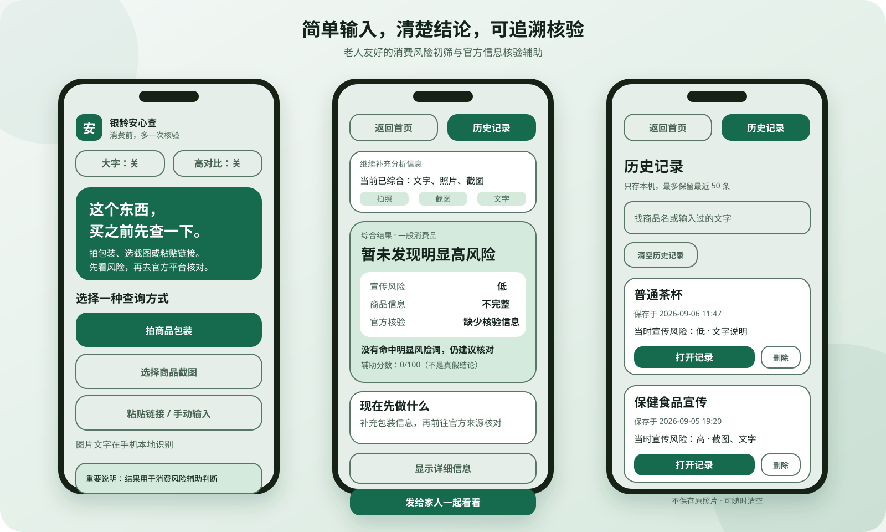

<div align="center">
  

# SilverGuard / 银龄安心查

**An Android application that helps older adults screen consumer-product risks and verify information through official sources.**

面向老年消费场景的 Android 风险初筛与官方核验辅助应用。

[](https://github.com/Looffeeuu/SilverGuard/actions/workflows/android.yml)


**Kotlin · Jetpack Compose · ML Kit OCR · Local-first**
</div>



## 为什么做 SilverGuard

老年消费者面对保健品、理疗产品、电商宣传和投资话术时，常常需要在包装、截图、商品链接和官方网页之间反复切换。SilverGuard 尝试把这段过程整理成一条更容易理解的路径：

> 收集商品信息 → 识别风险话术 → 整理核验线索 → 前往官方来源核对 → 与家人共享结果

它不替用户判断商品真假，也不冒充监管机构。项目重点是把风险提示、证据来源和下一步行动讲清楚。

## 核心能力

| 能力 | 当前实现 |
| --- | --- |
| 多种输入 | 拍摄包装、选择截图、粘贴商品链接或手动输入；多来源信息合并分析 |
| 中文 OCR | 使用 ML Kit 在设备端识别包装与截图文字，不上传原图 |
| 可解释风险初筛 | 本地规则识别疾病功效、夸大承诺、限时催促等话术，并展示命中原因 |
| 商品信息结构化 | 提取商品名、品牌、生产企业、型号、规格、注册/备案号和价格 |
| 官方核验辅助 | 分类常见注册/备案编号，匹配官方入口，记录人工核对与截图比对结果 |
| 老人友好交互 | 大字、高对比、一键朗读、大按钮、分层结果和家人分享 |
| 本地价格参考 | 对用户录入的同款报价做区间比较；不伪装成实时全网价格 |
| 历史记录 | 本机保存最近 50 次分析，可搜索、打开、删除或清空 |

## 设计原则

- **先给结论，再给依据。** 结果页默认只展示风险结论、下一步和补充信息建议，详细证据按需展开。
- **来源决定建议。** 文字输入时建议补充照片或截图；拍摄信息不足时提示补拍，但不强迫用户继续。
- **多来源合并。** 文字、照片、截图和商品链接共同形成一份分析，不互相覆盖。
- **谨慎表达。** “未识别到注册号”不等于假货，“话术相似”不等于案例对象，“打开官方网页”不等于核验通过。
- **本地优先。** OCR、规则分析、案例匹配、价格比较和历史记录默认在设备上完成。

## 工作流程


## 技术实现

- **UI:** Kotlin, Jetpack Compose, Material 3
- **OCR:** Google ML Kit Chinese Text Recognition
- **Networking:** OkHttp, Jsoup；严格限制电商域名与跳转范围
- **Architecture:** `model / data / engine / network / parser / ui` 分层
- **Privacy:** 应用私有本地历史；原照片不写入历史；AI 在 v0.5.0 默认关闭
- **Compatibility:** Android 6.0+（minSdk 23），compileSdk / targetSdk 37，JDK 17

```text
app/src/main/java/com/silverguard/app/
├── data/       官方来源、案例资料、本地历史
├── engine/     提取、分类、风险与核验规则
├── model/      领域模型
├── network/    受限网页读取与可选 AI 接口
├── parser/     电商公开页面解析
└── ui/         Compose 页面与组件
```

## 数据来源与可追溯性

官方入口只配置政府和监管机构域名，包括国家药品监督管理局、医疗器械 UDI、国家市场监督管理总局政务服务与特殊食品查询平台。案例提示来自公开监管案例和消费提示，并在界面中保留来源、发布日期和原文链接。

- [市场监管总局：老年人药品、保健品虚假宣传典型案例](https://www.samr.gov.cn/xw/zj/art/2025/art_a1f4895b3b3648669587a87afb28c435.html)
- [市场监管总局 / 中国消费者协会：私域直播消费风险提示](https://www.samr.gov.cn/xw/zj/art/2025/art_096968970c684f76bcdf578a00233e5c.html)
- [湖北金融监管局：老年群体投资理财风险提示](https://www.nfra.gov.cn/branch/hubei/view/pages/common/ItemDetail.html?docId=1251457&itemId=1414)

来源配置集中在 `OfficialSources` 与 `RiskCaseRepository`，便于复核和更新。内置资料不是实时数据库，也不完整覆盖所有风险。

## 测试与质量

当前本地验收结果：

- **123 项 JVM 单元测试**：提取、编号分类、官方来源、风险规则、报价、历史序列化、分享报告等
- **7 项 Android UI 测试**：主要入口、无障碍开关、详情折叠、价格录入、返回首页、历史恢复与删除
- 普通模式与高对比模式包含最低文字对比度测试
- `test + assembleDebug + connectedDebugAndroidTest` 均通过

GitHub Actions 会在每次提交和 Pull Request 上运行单元测试、构建 Debug APK，并保留构建产物。

## 当前边界

SilverGuard v0.5.0 是一个可运行的本地优先 MVP，目前**不会**：

- 自动查询或声称已经通过国家官方数据库核验
- 保证读取所有淘宝 / 天猫动态详情、评论或登录后页面
- 提供实时全网比价或官方指导价
- 因为“查不到”或“没有注册号”直接认定商品是假货
- 默认调用付费 AI；实验性 AI 接入代码保留，但发布构建默认关闭

更完整的说明见 [隐私与能力边界](docs/PRIVACY_AND_LIMITATIONS.md)。

## 在 Android Studio 运行

环境：最新稳定版 Android Studio、JDK 17、Android SDK 37。

```powershell
git clone https://github.com/Looffeeuu/SilverGuard.git
cd SilverGuard
.\gradlew.bat testDebugUnitTest assembleDebug
```

也可以直接在 Android Studio 中打开仓库，等待 Gradle Sync 后运行 `app`。首次构建需要联网下载 Gradle 与 Android 依赖。

## 当前状态与路线图

**Current status:** v0.5.0 · Local-first MVP · AI disabled by default

- [x] 老人友好交互与多来源输入
- [x] 商品信息结构化与本地风险初筛
- [x] 官方核验入口、人工证据记录与截图辅助比对
- [x] 有来源的案例提示、本地报价参考与历史记录
- [ ] 在取得稳定、合法接口后接入自动官方数据查询
- [ ] 在成本和隐私方案明确后恢复可选 AI 语义辅助
- [ ] 根据真实老年用户测试继续优化无障碍与异常恢复

## 项目文档

- [架构与关键决策](docs/ARCHITECTURE.md)
- [隐私与能力边界](docs/PRIVACY_AND_LIMITATIONS.md)
- [版本历程](docs/RELEASE_NOTES.md)

---

<div align="center">
  <strong>消费前，多一次核验。</strong><br />
  Risk assistance, not an official certification or medical diagnosis.
</div>
